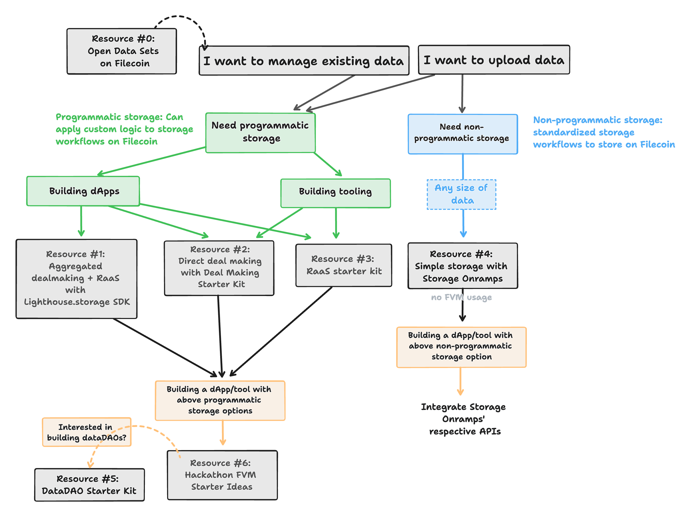

# web3-quick start

Web3.storage is powered by filecoin. This is one of out of 3 solutions to upload files to filecoin network. This is specifically the on-ramp solution.

[Solution Doc](https://docs.filecoin.io/basics/how-storage-works/storage-onramps/)

[](https://github.com/filecoin-project/awesome-filecoin/blob/main/fvm.md)


```shell
pnpm install
```
```shell
npm run start main.ts
```

Replace `main.ts` with any file or files supports multiple files

```shell
npm run start main.ts package.json .prettierrc
```